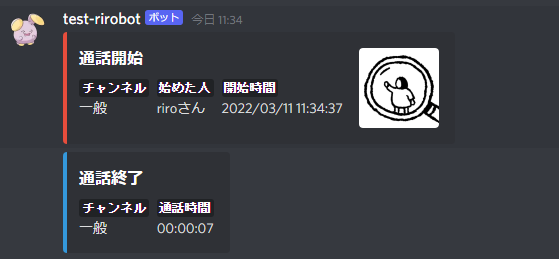
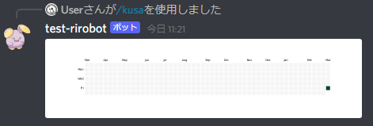

# Discord Voice Channel Notify Bot
ボイスチャンネルへの入退室をテキストチャンネルに通知して、通話時間を記録・可視化するDiscord Bot

## 機能

### 通知機能
ボイスチャンネルへの入退室時にテキストチャンネルに通知する



通知を行うのは以下のイベント時
- 誰かがボイスチャンネルに入ったとき
- ボイスチャンネルから全員が退出したとき

誰かがボイスチャンネルに入ってから全員がボイスチャンネルから退出するまでを一つの通話単位として通話時間を記録する

通話が始まってから抜けた人が全員退出する前に再入室しても通知は行わない

### 通話時間可視化機能

`/kusa`コマンドを使用することで今までの通話時間をヒートマップで確認できる



引数にボイスチャンネルを指定すれば、そのボイスチャンネルでの通話時間記録だけを可視化することもできる

通話時間の記録が無い場合は以下のようなメッセージが返ってくる


# 実行環境
- `python 3.10`
- `pycord 2.0.0b1`
- `poetry 1.1.13`

# 初期設定

## 環境変数
プロジェクトルートディレクトリに`.env`を配置して以下を記述
```
# 必須
TOKEN=Discordのトークン
NOTIFY_CHANNEL_ID=通知するチャンネルのチャンネルID
SERVER_ID=通知するサーバーのID

# オプション（なくてもいい）
ERROR_NOTIFY_INCOMING_WEBHOOK_URL=エラーを通知するdiscordチャンネルのIncoming Webhook URL
```

### Dockerのインストール
参考: [Ubuntu 20.04へのDockerのインストールおよび使用方法](https://www.digitalocean.com/community/tutorials/how-to-install-and-use-docker-on-ubuntu-20-04-ja)


# 起動方法

```
# イメージのビルド
docker build -t notify-bot:latest .

# コンテナの実行
docker run --rm -e TZ=Asia/Tokyo --env-file .env --name notify-bot -v $(pwd):/app notify-bot:latest
```
